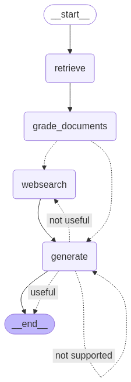

# Advanced Rag Application

This is an advanced pattern for implementing the rag application that we have all come to know and love.  It involves both vector and websearch capabilites, as well as the ability to check its own hallucinations and correct them.  

As you can see from this clear, concise, easy to understand graph:

Which totally doesn't look like the pepe silvia meme from it's always sunny in philadelphia

The app tries to retrieve relevant documents from the vector database, decides whether or not these documents are relevant, then if they aren't, it queries the internet to find relevant documents using Tavily.  It then looks to see if the output has any hallucinations it it.  If it does, it regenerates output.  Finally, once the response is deemed to be solid, it prints the output.  